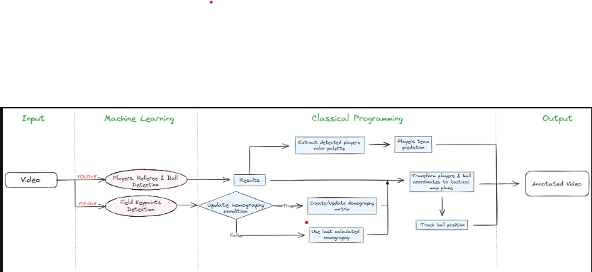

# Project Title

## Table of Contents

- [About](#about)
- [Getting Started](#getting_started)
- [Usage](#usage)
- [Resources](#resources)
- [To-Do](./todo.md)
- [Contributing](../CONTRIBUTING.md)

## About <a name = "about"></a>

This project aims to identify and monitor players, referees, and footballs in video footage using YOLO, a top-tier AI object detection model. The model should be trained further to enhance its efficiency. Moreover, categorization of players into teams based on their jersey colors, using Kmeans for pixel segmentation and clustering can be added. 

This data will allow us to calculate the percentage of ball possession for each team during a game. Optical flow is implimented to gauge camera movement across frames, which will help in precisely tracking a player's motion. Additionally, perspective transformation is applied to depict the depth and perspective of the scene, enabling the measurement of a player's movement in meters(m) instead of pixels. 

Finally, a player's speed and the total distance travelled is calculated. I was aiming to encompass a range of concepts and tackle practical problems, making it an excellent learning opportunity through a rabbit hole.

## Getting Started <a name = "getting_started"></a>

These instructions will get you a copy of the project up and running on your local machine for development and testing purposes. See [deployment](#deployment) for notes on how to deploy the project on a live system.

### Prerequisites

Before you begin, ensure you have met the following requirements:

- You have installed the latest version of Python.

### Installing

To install this project, follow these steps:

1. Clone the repository:
    ```bash
    git clone https://github.com/your_username/your_project.git
    ```
2. Navigate to the project directory:
    ```bash
    cd your_project
    ```
3. Install the required packages:
    ```bash
    pip install -r requirements.txt
    ```
4. Run the main script:
    ```bash
    python main.py
    ```

## Usage <a name = "usage"></a>


## Technologies And Technologies

The following modules are used in this project:
- YOLO: AI object detection model
- Kmeans: Pixel segmentation and clustering to detect t-shirt color
- Optical Flow: Measure camera movement
- Perspective Transformation: Represent scene depth and perspective
- Speed and distance calculation per player


## Project Resources <a name = "resources"></a>

- The Video sample of the project : [Video Sample](https://drive.google.com/file/d/1t6agoqggZKx6thamUuPAIdN_1zR9v9S_/view?usp=sharing)
- The training model used:          [Training Model](https://drive.google.com/file/d/1DC2kCygbBWUKheQ_9cFziCsYVSRw6axK/view?usp=sharing)

## Application WorkFlow 


